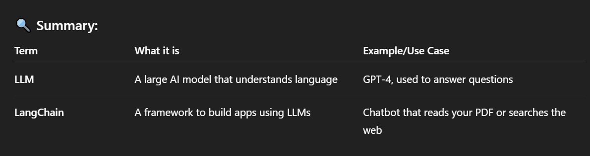

# LLM(Large Language Model) :
- An LLM is an **AI model trained on massive amounts of text data** (like books, websites, and articles) so it can understand and generate human-like language.

## Examples of LLMs :

- ChatGPT (based on OpenAI's GPT models).

- Google's PaLM.

- Meta's LLaMA.

- Anthropic's Claude.

## What can LLMs do ?

- <mark>Answer questions </mark>

- <mark>Translate languages </>

- <mark>Summarize text </mark>

- <mark>Write stories or code </>

- <mark>Chat with users like I'm doing now </mark>

# Langchain :
- LangChain is a framework that helps developers build apps using LLMs.

## A toolkit that connects LLMs with other things like :
- **Databases**

- **Web search**

- **Documents (PDFs, websites, etc.)**

- **APIs**

- **Memory or history of the conversation**

## What LangChain helps with :

- Building chatbots that remember your previous messages

- Connecting LLMs to your own data (e.g., asking questions about your files)

- Creating custom AI assistants or agents that can reason, search, and act

## Popular Use Cases :

- Chat with your documents (like a smart PDF reader)

- Customer support bots

- Personal AI assistants

- AI tools that write code or generate reports

