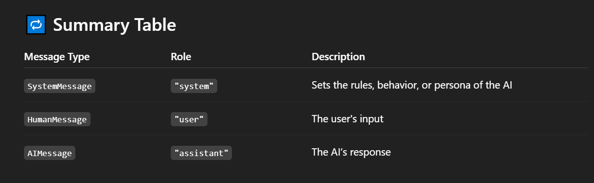

# SystemMessage, HumanMessage and AIMessage :
- In LangChain (and OpenAI’s chat-based APIs), <mark>**conversations with chat models**</mark> (like GPT-4) are structured using message types to define who is "speaking". These are:

## **1. SystemMessage** :
- <mark>Role </mark>: **"system"**

- <mark>Purpose </mark>: **Sets behavior, tone, or context for the assistant.**

- <mark>Used to </mark>: **Prime the assistant with rules or instructions before the conversation begins.**

### **Example** :
```
from langchain.schema import SystemMessage

SystemMessage(content="You are a helpful assistant that speaks like Shakespeare.")

```

## **2. HumanMessage** :
- <mark>Role </mark>: **"user"**

- <mark>Purpose </mark>: **Represents input from the human (i.e., the end user).**

- <mark>Used to </mark>: **Ask questions, give prompts, or issue commands.**

### **Example** :
```
from langchain.schema import HumanMessage

HumanMessage(content="Can you explain gravity?")

```

## **🤖 3. AIMessage** :
<mark>Role </mark>: **"assistant"**

<mark>Purpose </mark>: **Represents output from the AI model (what it would say).**

<mark>Used to </mark>: **Simulate or store the assistant's previous responses.**

### **Example** :
```
from langchain.schema import AIMessage

AIMessage(content="Gravity is a force that pulls objects toward each other.")

```

# Putting It All Together (Chat Prompt)
You can structure a conversation like this:
```
from langchain.chat_models import ChatOpenAI
from langchain.schema import SystemMessage, HumanMessage, AIMessage
import os

chat = ChatOpenAI(openai_api_key=os.environ["OPEN_API_KEY"], temperature=0.7)

messages = [
    SystemMessage(content="You are a friendly travel advisor."),
    HumanMessage(content="Can you recommend a destination for summer?"),
]

response = chat(messages)
print(response.content)

```

