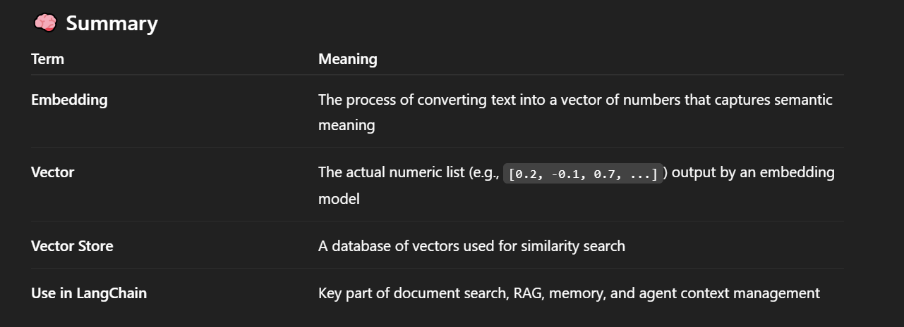

# Vectors and Emobeddings :
- In LangChain, embeddings and vector stores are **<mark>mostly used to search and retrieve relevant text for a given query </mark>** — and yes, this is often based on reading from files or databases, but that's just the starting point.

# Embeddings :
- An embedding is <mark>**a numeric representation of data—typically text—in the form of a vector**(a list of floating-point numbers).</mark>
- The goal is to capture the semantic meaning of text so that similar texts have similar embeddings.

- **<mark>it converts the text into vector. </mark>**

## Example :
- <mark>Text </mark> : "What's the weather like today?"
- <mark>Embedding </mark> : [0.12, -0.98, 0.33, ..., 0.44] (say, a 768-dimensional vector)

## **note** :
### These embeddings are generated using embedding models, such as:
- **OpenAI** (text-embedding-3-small, text-embedding-ada-002, etc.)

- **Hugging Face models** (e.g., sentence-transformers)

- **Cohere, Google, and others**

# Vector :
- it's the **<mark>numerical list (vector of floats) that represents a piece of text. </mark>**

- "**Vector**" = The actual list of numbers.

- "**Embedding**" = The process of turning text into a vector.

## Key Use Case: **Retrieval-Augmented Generation (RAG)** :
### **1.** Input documents are split into chunks (using a TextSplitter)

### **2.** Each chunk is embedded into a vector

### **3.** These vectors are stored in a vector store (e.g., FAISS, Chroma, Pinecone, Weaviate)

### **4.** When a user asks a question:

- **.** The question is embedded into a vector

- **1.** That vector is used to find similar vectors (chunks) in the vector store

- **1.** The retrieved chunks are fed to the LLM for answering the question

```
from langchain.embeddings import OpenAIEmbeddings
from langchain.vectorstores import FAISS
from langchain.text_splitter import RecursiveCharacterTextSplitter
from langchain.document_loaders import TextLoader

# Step 1: Load and split documents
loader = TextLoader("your_doc.txt")
docs = loader.load()
splitter = RecursiveCharacterTextSplitter(chunk_size=500, chunk_overlap=100)
chunks = splitter.split_documents(docs)

# Step 2: Convert to embeddings
embedding_model = OpenAIEmbeddings()
vectorstore = FAISS.from_documents(chunks, embedding_model)

# Step 3: Query with similarity search
query = "What is this document about?"
docs_relevant = vectorstore.similarity_search(query, k=3)

# If you want to print the output:
for doc in docs_relevant:
    print(doc.page_content)

```

## summary/output :
### 1. suppose we have somthing in 'your_doc.txt' file :
- LangChain is a framework for developing applications powered by language models. It enables chaining of components like LLMs, prompts, memory, and tools. LangChain is commonly used for building chatbots, retrieval-based QA systems, and agents.

### 2. Then a query like "What is this document about?" might return something like this:

```
*OUTPUT :
1. LangChain is a framework for developing applications powered by language models.

2. It enables chaining of components like LLMs, prompts, memory, and tools.

3. LangChain is commonly used for building chatbots, retrieval-based QA systems, and agents.

```

### **<mark>Notes </mark>**:
- **If your_doc.txt is large, the document will be split into smaller chunks**.

- **The number of returned chunks (k=3) can be changed.**

- **The semantic similarity depends on the embedding model — here, it's OpenAI's**.

